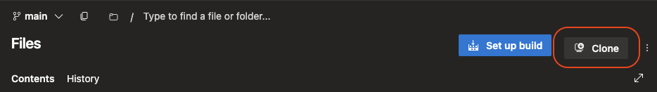

# Multi-environment setup using Azure pipelines
Manage multiple environments by using Bicep and Azure Pipelines

Follow [this](https://learn.microsoft.com/en-us/training/modules/manage-multiple-environments-using-bicep-azure-pipelines/1-introduction) link to get an overview of azure pipelines.
&
https://learn.microsoft.com/en-us/training/modules/manage-multiple-environments-using-bicep-azure-pipelines/

### To create a multi-stage pipeline use the following template:


- [Create the project](#create-the-project)
- [Clone the repository](#clone-the-repository)
- [Create resource groups in Azure portal](#create-resource-groups-in-azure-portal)
- [Create two service connections](#create-two-service-connections)
- [Create two env i,e environmentType](#create-two-env-ie-environmenttype)

## Create the project.

Use this [template](https://azuredevopsdemogenerator.azurewebsites.net/?name=bicepenvironments) to create a project.

## Clone the repository.

Clone the repo in VScode. And generate the password.


## Open in VS code.

## Create resource groups in Azure portal.
login to azure and execute the following different or same azure subscription.

```
 az group create --name xfactorTest --location northeurope
 az group create --name xfactorProduction --location northeurope
```

## Create two service connections.

To create a **service connections** for each subscription:
   - In project settings (*located at bottom*) → click: **Service connections** → Create service connection → Azure Resource Manager → Service principal (automatic) → select: Subscription → Resource group: **xfactorTest** → Service connection name: **xfactorTest**.

## Create two env's i,e environmentType

under pipeline Environments, create **New environment** named: Dev, Test, Production. 

To allow pipeline to access the environemnt. On top right corner click three dots → Security → Restrict permission → Open access.

**Note:** remove variables for pipelines by clicking edit.